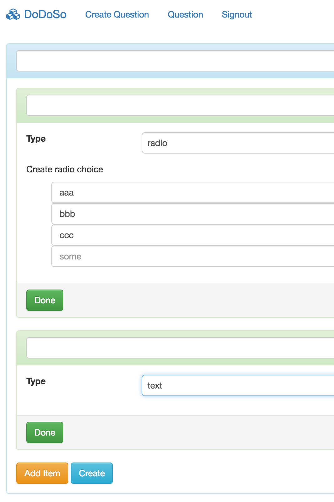
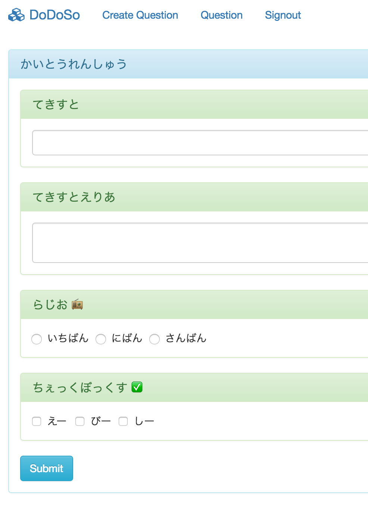

DoDoSo
-----

Question Generator System like Google Forms.

## Screenshots





## How to install

```zsh
% git clone https://github.com/muddydixon/dodoso.git
% cd dodoso
% npm install
% docker run -d -p 3306:3306 -e MYSQL_ROOT_PASSWORD XXXX mysql
% mysql -h192.168.99.100 -uroot -p < ./migrations/create_db.sql
% npm run db:migrate
% npm start
```

## License
[Apache License Version 2.0](https://www.apache.org/licenses/LICENSE-2.0)
